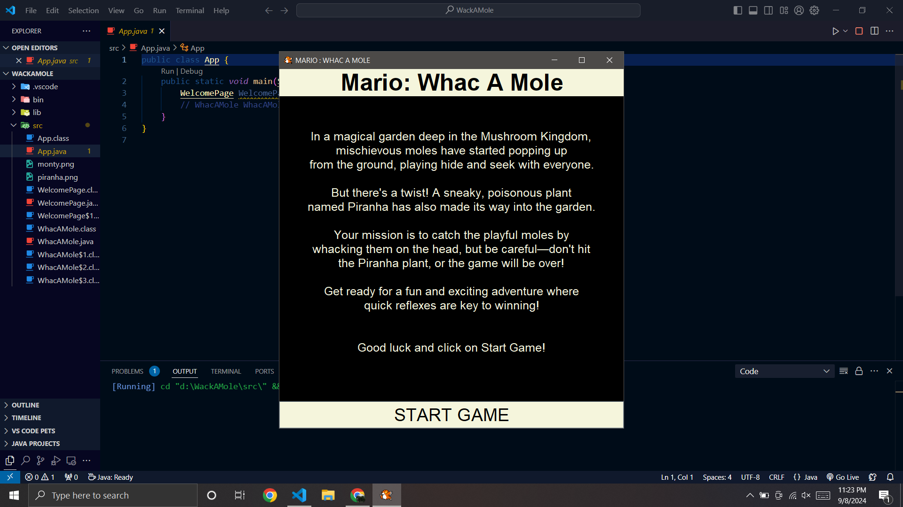

# Mario: Whac-A-Mole

Welcome to **Mario: Whac-A-Mole**—a fun and engaging game where players must whack moles popping up from the ground while avoiding a sneaky poisonous plant! Developed using Java, this game is designed for entertainment and quick reflexes.

## Screenshots
Here are some screenshots of the game:




 

## Features
- **Game Interface**: A vibrant GUI with a start screen and a game board.
- **Game Mechanics**: Click on the moles to score points while avoiding the Piranha plant.
- **Scoring System**: Earn points by hitting moles; the game ends if you hit the Piranha plant.

## Installation
1. Clone this repository:
   ```sh
   git clone https://github.com/Aastha-Bhatia/Wac-A-Mole---Java.git

   ```
2. Navigate to the project directory:
   ```sh
   cd Wac-A-Mole---Java/WackAMole/src
   ```
3. Compile the Java files:
   ```sh
   javac App.java
   ```
4. Run the application:
   ```sh
   java App
   ```

## Usage
- **Start the Game**: Click the "START GAME" button on the welcome screen.
- **Gameplay**: Click on the moles to increase your score. Avoid the Piranha plant, which ends the game.

## License
This project is licensed under the MIT License. See the [LICENSE](LICENSE) file for details.

## Acknowledgments
- **Java**: The programming language used to create this game.
- **Icon Images**: Used for moles and plants.

## Created By
Aastha Bhatia

## Special Thanks
Thanks to Kenny YiP Coding for the tutorials that helped me learn and build this game. 

Connect with me on https://www.linkedin.com/in/aasthabhatia-er/

Feel free to contribute or provide feedback!
Feel free to adjust the content as needed to better fit your project or personal preferences!
